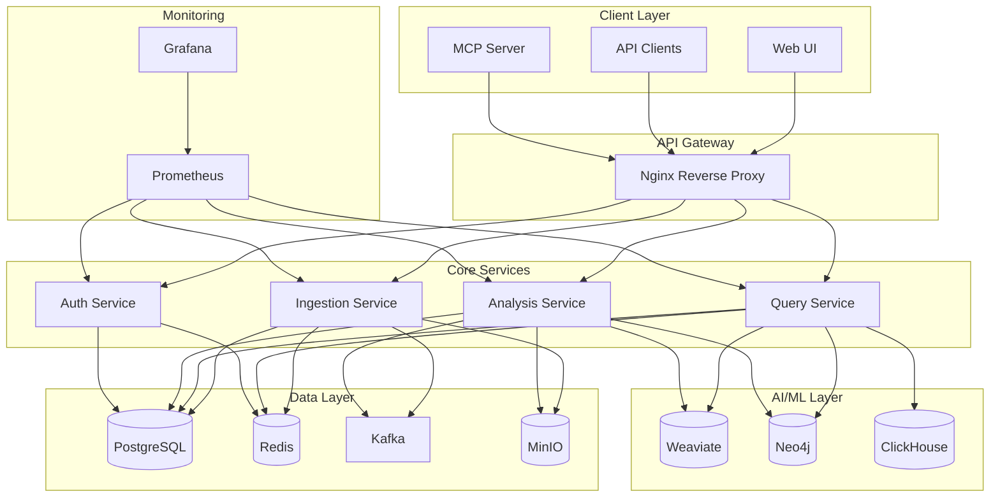
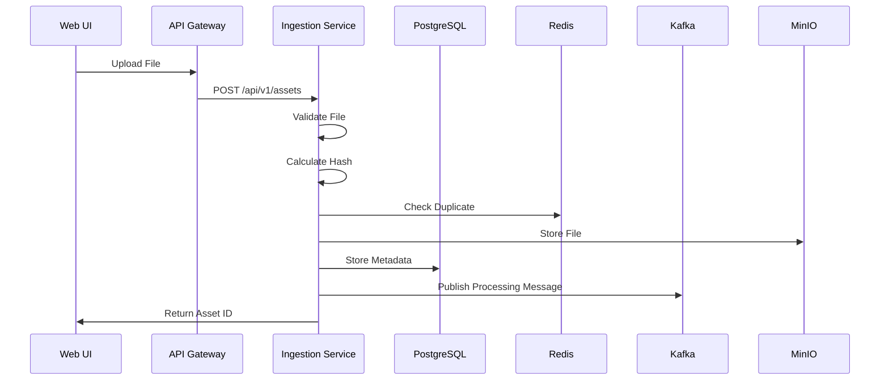
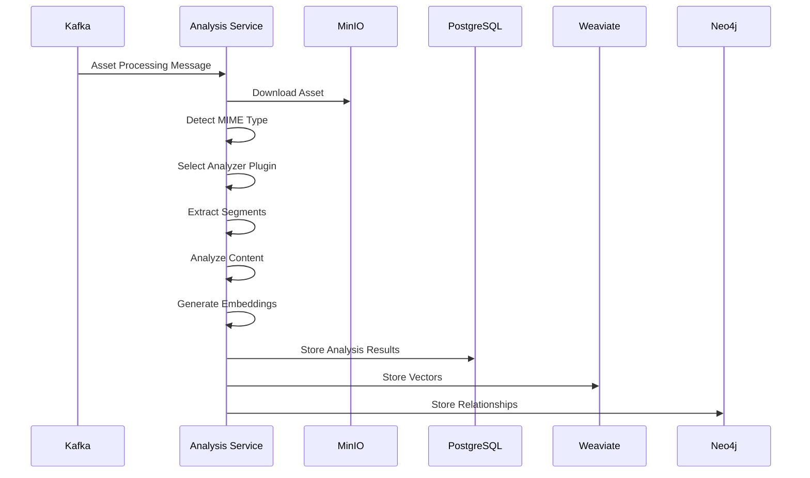
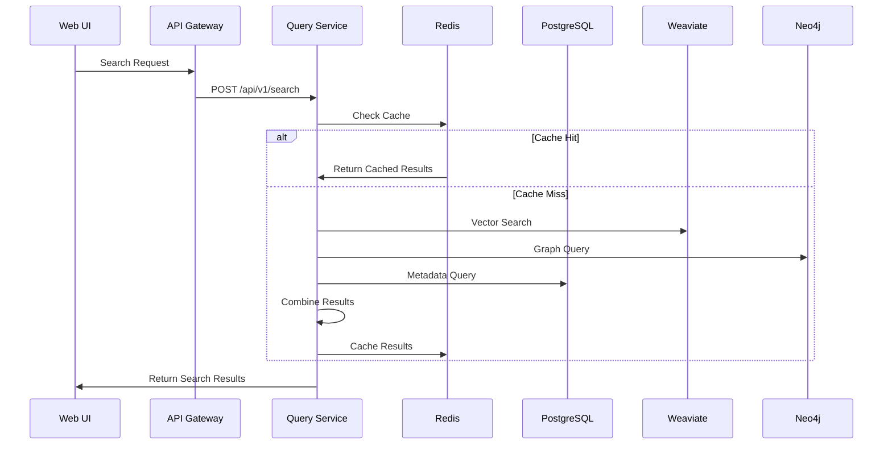

# DataFlux Architecture Documentation

## Overview

DataFlux ist eine **Universal AI-native Database** für Medieninhalte mit einer **Plugin-Architektur** und **Multi-Modal Search** Capabilities. Das System wurde entwickelt, um große Mengen von Medieninhalten zu verarbeiten, zu analysieren und durchsuchbar zu machen.

## Core Principles

### 1. Media-Agnostic Pipeline
- **Universal Processing**: Unterstützt Video, Audio, Bilder und Dokumente
- **Pluggable Analyzers**: Erweiterbare Plugin-Architektur für neue Medienformate
- **Hierarchical Relationships**: Film → Szenen → Frames → Objekte
- **Immutable Versioning**: Vollständige Nachverfolgbarkeit aller Änderungen

### 2. Multi-Modal Search
- **Cross-Modal Queries**: Suche über verschiedene Medientypen hinweg
- **Semantic Understanding**: KI-basierte Inhaltsanalyse
- **Vector Similarity**: Ähnlichkeitssuche mit Embeddings
- **Graph Relationships**: Beziehungsbasierte Suche mit Neo4j

### 3. Hybrid Processing
- **Batch & Stream**: Kombinierte Verarbeitung je nach Dateigröße
- **Priority Queues**: Intelligente Priorisierung basierend auf Inhaltstyp
- **Scalable Architecture**: Horizontale Skalierung aller Komponenten

## System Architecture

### High-Level Architecture



### Service Architecture

#### 1. Ingestion Service (FastAPI)
- **Port**: 8002
- **Responsibilities**:
  - File upload und Validierung
  - Hash-basierte Deduplication
  - MinIO Storage Integration
  - Kafka Message Publishing
  - PostgreSQL Metadata Storage

#### 2. Query Service (Go/Gin)
- **Port**: 8003
- **Responsibilities**:
  - Multi-Modal Search Engine
  - Redis Caching
  - Weaviate Vector Search
  - Neo4j Graph Queries
  - ClickHouse Analytics

#### 3. Analysis Service (Python)
- **Port**: 8004
- **Responsibilities**:
  - Kafka Consumer für Asset Processing
  - Plugin-basierte Analyzer
  - AI/ML Model Integration
  - Feature Extraction
  - Embedding Generation

#### 4. Auth Service (FastAPI)
- **Port**: 8006
- **Responsibilities**:
  - JWT Token Management
  - User Authentication
  - Role-Based Access Control (RBAC)
  - Permission Management
  - Session Management

#### 5. MCP Server (TypeScript)
- **Ports**: 2015/2016
- **Responsibilities**:
  - LLM Integration
  - Tool Registration
  - Resource Management
  - Prompt Templates

#### 6. Web UI (Next.js)
- **Port**: 3000
- **Responsibilities**:
  - User Interface
  - Asset Management
  - Search Interface
  - Analytics Dashboard

#### 7. API Gateway (Nginx)
- **Ports**: 2013/2014
- **Responsibilities**:
  - Request Routing
  - Rate Limiting
  - CORS Handling
  - SSL/TLS Termination
  - Load Balancing

## Data Flow

### 1. Asset Upload Flow



### 2. Analysis Processing Flow



### 3. Search Flow



## Data Model

### Core Entities

#### 1. Entities Table
```sql
CREATE TABLE entities (
    entity_id UUID PRIMARY KEY DEFAULT gen_random_uuid(),
    entity_type VARCHAR(50) NOT NULL,
    name VARCHAR(255) NOT NULL,
    description TEXT,
    metadata JSONB,
    is_active BOOLEAN DEFAULT TRUE,
    created_at TIMESTAMP WITH TIME ZONE DEFAULT CURRENT_TIMESTAMP,
    updated_at TIMESTAMP WITH TIME ZONE DEFAULT CURRENT_TIMESTAMP
);
```

#### 2. Assets Table
```sql
CREATE TABLE assets (
    asset_id UUID PRIMARY KEY DEFAULT gen_random_uuid(),
    entity_id UUID REFERENCES entities(entity_id),
    file_name VARCHAR(255) NOT NULL,
    file_size BIGINT NOT NULL,
    mime_type VARCHAR(100) NOT NULL,
    file_hash VARCHAR(64) UNIQUE NOT NULL,
    status VARCHAR(20) DEFAULT 'pending',
    collection_id UUID REFERENCES collections(collection_id),
    metadata JSONB,
    thumbnail_path VARCHAR(500),
    proxy_path VARCHAR(500),
    confidence_score DECIMAL(3,2),
    is_active BOOLEAN DEFAULT TRUE,
    created_at TIMESTAMP WITH TIME ZONE DEFAULT CURRENT_TIMESTAMP,
    updated_at TIMESTAMP WITH TIME ZONE DEFAULT CURRENT_TIMESTAMP
);
```

#### 3. Segments Table
```sql
CREATE TABLE segments (
    segment_id UUID PRIMARY KEY DEFAULT gen_random_uuid(),
    asset_id UUID REFERENCES assets(asset_id),
    segment_type VARCHAR(50) NOT NULL,
    start_time DECIMAL(10,3),
    end_time DECIMAL(10,3),
    duration DECIMAL(10,3),
    confidence_score DECIMAL(3,2),
    segment_data JSONB,
    is_active BOOLEAN DEFAULT TRUE,
    created_at TIMESTAMP WITH TIME ZONE DEFAULT CURRENT_TIMESTAMP,
    updated_at TIMESTAMP WITH TIME ZONE DEFAULT CURRENT_TIMESTAMP
);
```

#### 4. Features Table
```sql
CREATE TABLE features (
    feature_id UUID PRIMARY KEY DEFAULT gen_random_uuid(),
    segment_id UUID REFERENCES segments(segment_id),
    feature_type VARCHAR(50) NOT NULL,
    feature_data JSONB NOT NULL,
    confidence_score DECIMAL(3,2),
    is_active BOOLEAN DEFAULT TRUE,
    created_at TIMESTAMP WITH TIME ZONE DEFAULT CURRENT_TIMESTAMP,
    updated_at TIMESTAMP WITH TIME ZONE DEFAULT CURRENT_TIMESTAMP
);
```

#### 5. Embeddings Table
```sql
CREATE TABLE embeddings (
    embedding_id UUID PRIMARY KEY DEFAULT gen_random_uuid(),
    asset_id UUID REFERENCES assets(asset_id),
    segment_id UUID REFERENCES segments(segment_id),
    model_name VARCHAR(100) NOT NULL,
    dimension INTEGER NOT NULL,
    embedding_vector FLOAT[] NOT NULL,
    is_active BOOLEAN DEFAULT TRUE,
    created_at TIMESTAMP WITH TIME ZONE DEFAULT CURRENT_TIMESTAMP,
    updated_at TIMESTAMP WITH TIME ZONE DEFAULT CURRENT_TIMESTAMP
);
```

#### 6. Relationships Table
```sql
CREATE TABLE relationships (
    relationship_id UUID PRIMARY KEY DEFAULT gen_random_uuid(),
    source_entity_id UUID REFERENCES entities(entity_id),
    target_entity_id UUID REFERENCES entities(entity_id),
    relationship_type VARCHAR(50) NOT NULL,
    confidence_score DECIMAL(3,2),
    relationship_data JSONB,
    is_active BOOLEAN DEFAULT TRUE,
    created_at TIMESTAMP WITH TIME ZONE DEFAULT CURRENT_TIMESTAMP,
    updated_at TIMESTAMP WITH TIME ZONE DEFAULT CURRENT_TIMESTAMP
);
```

### Plugin Architecture

#### Base Analyzer Interface
```python
class BaseAnalyzer(ABC):
    @abstractmethod
    def get_supported_formats(self) -> List[str]:
        """Return list of supported MIME types"""
        pass
    
    @abstractmethod
    def extract_segments(self, file_path: str) -> List[Segment]:
        """Extract segments from media file"""
        pass
    
    @abstractmethod
    def analyze_segment(self, segment: Segment) -> AnalysisResult:
        """Analyze a single segment"""
        pass
    
    @abstractmethod
    def generate_embeddings(self, content: Any) -> List[Embedding]:
        """Generate embeddings for content"""
        pass
```

#### Video Analyzer Implementation
```python
class VideoAnalyzer(BaseAnalyzer):
    def get_supported_formats(self) -> List[str]:
        return ['video/mp4', 'video/avi', 'video/mov', 'video/mkv']
    
    def extract_segments(self, file_path: str) -> List[Segment]:
        # Scene detection using OpenCV
        # Shot boundary detection
        # Key frame extraction
        pass
    
    def analyze_segment(self, segment: Segment) -> AnalysisResult:
        # Object detection with YOLO
        # Face recognition
        # OCR text extraction
        # Audio analysis
        pass
```

## Storage Architecture

### Multi-Tier Storage Strategy

#### 1. Hot Tier (Redis)
- **Purpose**: Frequently accessed data
- **Content**: Search results, user sessions, cache
- **Retention**: 1-7 days
- **Access Pattern**: Sub-millisecond

#### 2. Warm Tier (PostgreSQL + MinIO)
- **Purpose**: Active data and metadata
- **Content**: Asset metadata, analysis results, user data
- **Retention**: 1-5 years
- **Access Pattern**: Milliseconds to seconds

#### 3. Cold Tier (S3 Glacier)
- **Purpose**: Long-term archival
- **Content**: Old assets, backups
- **Retention**: 5+ years
- **Access Pattern**: Minutes to hours

### Database Sharding Strategy

#### Hybrid Sharding (Hash + Range)
```sql
-- Hash sharding on entity_id
CREATE TABLE assets_shard_0 PARTITION OF assets
FOR VALUES WITH (MODULUS 4, REMAINDER 0);

-- Range sharding on created_at
CREATE TABLE assets_2024_q1 PARTITION OF assets
FOR VALUES FROM ('2024-01-01') TO ('2024-04-01');
```

## Security Architecture

### Authentication & Authorization

#### JWT Token Structure
```json
{
  "sub": "username",
  "iat": 1640995200,
  "exp": 1640998800,
  "scopes": ["assets:read", "assets:write", "collections:manage"],
  "role": "analyst"
}
```

#### Permission System
```sql
-- Role-based permissions
CREATE TABLE roles (
    role_id UUID PRIMARY KEY,
    role_name VARCHAR(50) UNIQUE NOT NULL,
    permissions TEXT[] NOT NULL
);

-- User roles
CREATE TABLE user_roles (
    user_id UUID REFERENCES users(user_id),
    role_id UUID REFERENCES roles(role_id),
    PRIMARY KEY (user_id, role_id)
);
```

### Network Security

#### Service-to-Service Authentication
- **mTLS**: Mutual TLS between services
- **Service Mesh**: Istio for traffic management
- **API Keys**: Service-specific authentication

#### Data Encryption
- **At Rest**: AES-256 encryption for stored data
- **In Transit**: TLS 1.3 for all communications
- **Key Management**: HashiCorp Vault integration

## Monitoring & Observability

### Metrics Collection

#### Prometheus Metrics
```python
# Request metrics
REQUEST_COUNT = Counter('dataflux_requests_total', 'Total requests', ['service', 'endpoint', 'status'])
REQUEST_DURATION = Histogram('dataflux_request_duration_seconds', 'Request duration', ['service', 'endpoint'])

# Business metrics
ASSETS_PROCESSED = Counter('dataflux_assets_processed_total', 'Total assets processed', ['status'])
SEARCH_QUERIES = Counter('dataflux_search_queries_total', 'Total search queries', ['query_type'])
```

#### Grafana Dashboards
- **System Overview**: CPU, Memory, Disk, Network
- **Service Health**: Response times, error rates
- **Business Metrics**: Assets processed, search performance
- **Database Metrics**: Query performance, connection pools

### Logging Strategy

#### Structured Logging
```python
import structlog

logger = structlog.get_logger(__name__)
logger.info("Asset processed", 
           asset_id=asset_id, 
           processing_time=processing_time,
           status="completed")
```

#### Log Aggregation
- **ELK Stack**: Elasticsearch, Logstash, Kibana
- **Centralized Logging**: All services send logs to central collector
- **Log Retention**: 30 days hot, 1 year warm, 7 years cold

## Performance Optimization

### Caching Strategy

#### Multi-Level Caching
1. **L1 Cache**: Application memory (1000 items)
2. **L2 Cache**: Redis cluster (1TB)
3. **L3 Cache**: Database query cache

#### Cache Invalidation
- **TTL-based**: Automatic expiration
- **Event-driven**: Invalidation on data changes
- **Manual**: Administrative cache clearing

### Database Optimization

#### Indexing Strategy
```sql
-- Performance indexes
CREATE INDEX idx_assets_collection_status ON assets(collection_id, status);
CREATE INDEX idx_assets_mime_type_size ON assets(mime_type, file_size);
CREATE INDEX idx_segments_asset_type ON segments(asset_id, segment_type);
CREATE INDEX idx_embeddings_asset_model ON embeddings(asset_id, model_name);

-- Full-text search indexes
CREATE INDEX idx_assets_fulltext ON assets USING gin(to_tsvector('english', file_name || ' ' || description));
```

#### Query Optimization
- **Connection Pooling**: Optimized connection management
- **Query Caching**: Frequently used queries cached
- **Read Replicas**: Separate read/write databases

## Deployment Architecture

### Container Orchestration

#### Docker Compose (Development)
```yaml
version: '3.9'
services:
  postgres:
    image: postgres:15
    ports:
      - "2001:5432"
    environment:
      POSTGRES_DB: dataflux
      POSTGRES_USER: dataflux_user
      POSTGRES_PASSWORD: dataflux_pass
```

#### Kubernetes (Production)
```yaml
apiVersion: apps/v1
kind: Deployment
metadata:
  name: dataflux-ingestion
spec:
  replicas: 3
  selector:
    matchLabels:
      app: dataflux-ingestion
  template:
    metadata:
      labels:
        app: dataflux-ingestion
    spec:
      containers:
      - name: ingestion
        image: dataflux/ingestion:latest
        ports:
        - containerPort: 8002
        env:
        - name: POSTGRES_HOST
          value: "postgres-service"
```

### CI/CD Pipeline

#### GitHub Actions Workflow
```yaml
name: CI/CD Pipeline
on:
  push:
    branches: [main]
  pull_request:
    branches: [main]

jobs:
  build-and-test:
    runs-on: ubuntu-latest
    steps:
    - uses: actions/checkout@v3
    - name: Build Docker images
      run: docker-compose build
    - name: Run tests
      run: make test-all
    - name: Security scan
      run: trivy image dataflux/ingestion:latest
```

## Scalability Considerations

### Horizontal Scaling

#### Service Scaling
- **Stateless Services**: All services designed to be stateless
- **Load Balancing**: Nginx/HAProxy for request distribution
- **Auto-scaling**: Kubernetes HPA based on CPU/memory usage

#### Database Scaling
- **Read Replicas**: Multiple read-only PostgreSQL instances
- **Sharding**: Horizontal partitioning of large tables
- **Connection Pooling**: PgBouncer for connection management

### Performance Targets

#### Response Time Targets
- **Search Queries**: < 200ms (95th percentile)
- **Asset Upload**: < 5s for files < 100MB
- **Analysis Processing**: < 30s for 1-minute video
- **API Responses**: < 100ms (95th percentile)

#### Throughput Targets
- **Concurrent Users**: 10,000+
- **Assets per Hour**: 100,000+
- **Search Queries per Second**: 1,000+
- **Data Processing**: 1TB/hour

## Disaster Recovery

### Backup Strategy

#### Automated Backups
- **Database**: Daily full backups, hourly incremental
- **Object Storage**: Real-time replication to secondary region
- **Configuration**: Version-controlled infrastructure as code

#### Recovery Procedures
- **RTO**: 4 hours (Recovery Time Objective)
- **RPO**: 1 hour (Recovery Point Objective)
- **Testing**: Monthly disaster recovery drills

### High Availability

#### Multi-Region Deployment
- **Primary Region**: Active processing
- **Secondary Region**: Standby with data replication
- **Failover**: Automated failover within 5 minutes

#### Service Redundancy
- **Load Balancers**: Multiple instances with health checks
- **Databases**: Master-slave replication with automatic failover
- **Message Queues**: Kafka cluster with replication factor 3

## Future Enhancements

### Planned Features

#### Advanced AI/ML
- **Custom Models**: User-specific model training
- **Real-time Learning**: Continuous model improvement
- **Multi-modal Fusion**: Cross-modal understanding

#### Enterprise Features
- **Multi-tenancy**: Isolated customer environments
- **Advanced Analytics**: Business intelligence dashboards
- **API Rate Limiting**: Per-user rate limiting

#### Performance Improvements
- **Edge Computing**: CDN integration for global performance
- **GPU Acceleration**: CUDA support for ML workloads
- **Streaming Analytics**: Real-time data processing

This architecture provides a solid foundation for a scalable, maintainable, and performant media processing and search platform.
